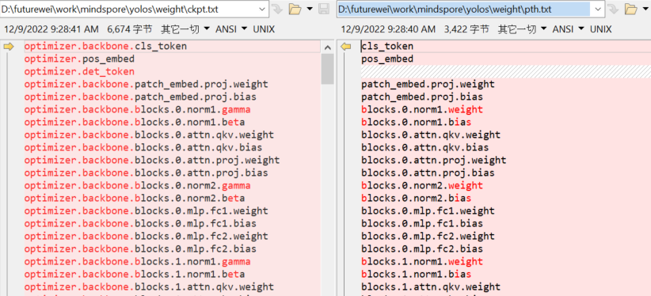

# Mindspore2Pytorch-weight-transform

# Description

This repo Transform the pytorch(.pth) model weight to mindspore (.ckpt). Use the [YOLOS](https://github.com/hustvl/YOLOS) pytorch trained model as example.

# How to Use

* Step 1: 

To transform the checkpoint file, we first need to understand the parameters' name format in pytorch and mindspore. Prepare the checkpoint file both from pytorch(.pth) and mindspore(.ckpt). For mindspore, all we need is the parameters' name, the value does not matter. One can use mindspore builtin function `save_checkpoint` in the your mindspore script to obtain the `.ckpt` file.


Edit the file path in `1_show.py`: `ckpt_file_path` and `pth_file_path`. Then run the python code, open `ckpt.txt` and `pth.txt` to see the name mapping between mindspore and pytorch. Different network will have different variable naming rule. But from pytorch mindspore, there are some common mapping:

```text
#mindspore.nn.LayerNorm - torch.nn.LayerNorm
'gamma':'weight', 'beta':'bias'

...
```




* Step 2:

Create mapping from mindspore parameters' name to pytorch's. Based on your mapping rule, edit `map_dict` and `dump` in `2_ckpt2pth_map.py`, change the `ckpt_file_path` to your `.ckpt` path. Run `2_ckpt2pth_map.py`, you will get a json file contain the parameters mapping. 

Check the json file to see if the mapping is correct, if else, edit the code or directly edit the json file to make the mapping correct.

```text
{"optimizer.backbone.cls_token": "backbone.cls_token", "optimizer.pos_embed": "pos_embed", "optimizer.det_token": "dist_token", "optimizer.backbone.patch_embed.proj.weight": "backbone.patch_embed.proj.weight", "optimizer.backbone.patch_embed.proj.bias": "backbone.patch_embed.proj.bias", "optimizer.backbone.blocks.0.norm1.gamma": "backbone.blocks.0.norm1.weight", "optimizer.backbone.blocks.0.norm1.beta": "backbone.blocks.0.norm1.bias", "optimizer.backbone.blocks.0.attn.qkv.weight": "backbone.blocks.0.attn.qkv.weight", "optimizer.backbone.blocks.0.attn.qkv.bias": "backbone.blocks.0.attn.qkv.bias", "optimizer.backbone.blocks.0.attn.proj.weight": "backbone.blocks.0.attn.proj.weight",

...
```

* Step 3:

3_pth2ckpt.py will get the parameter name in .ckpt file in order, and get the value from .pth file using the mapping created from step 2. Open `3_pth2ckpt.py`, change `ckpt_file_path`, `pth_file_path`, `ckpt2pth_map`.


Finally load the .ckpt file to mindspore script, if everything works, then converting is done.

